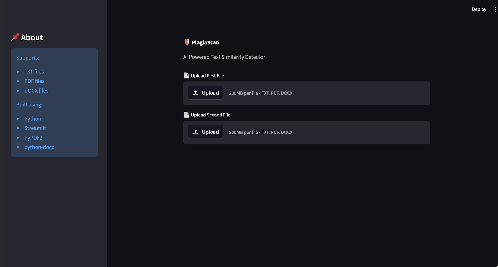
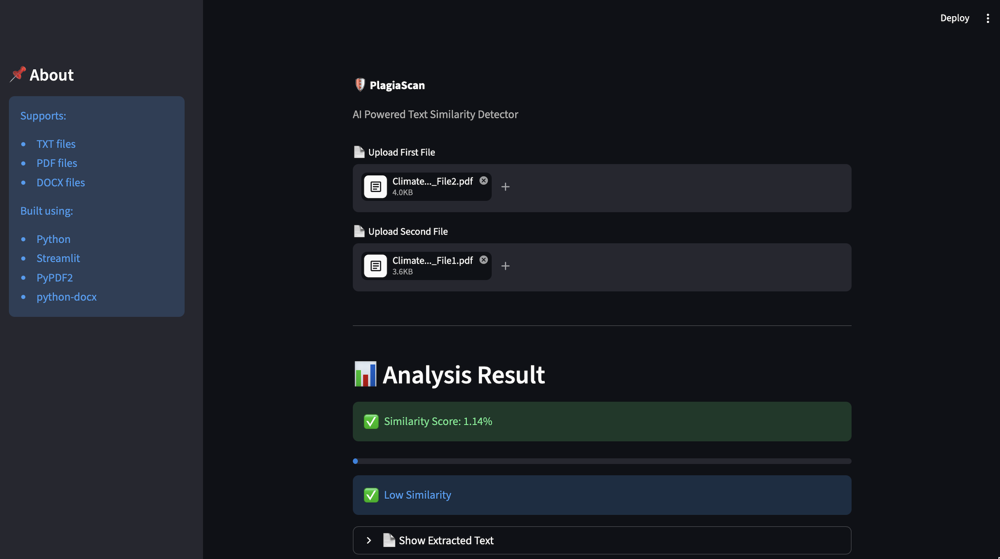
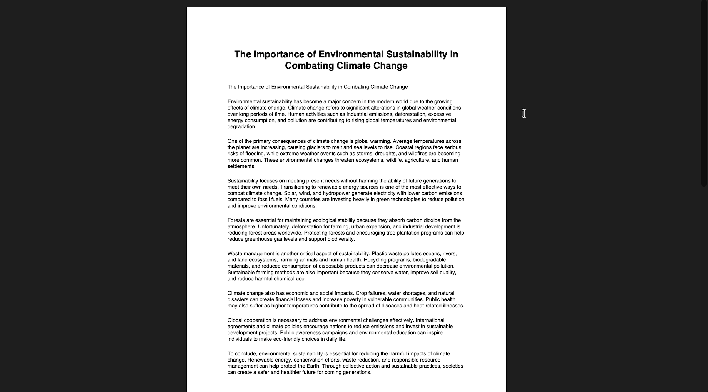
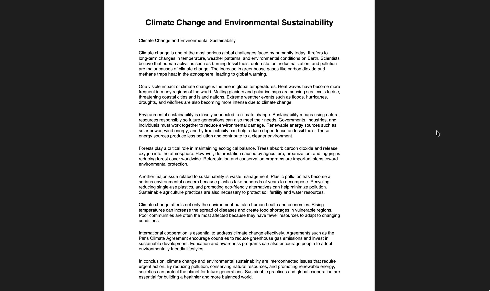

# 🛡️ PlagiaScan

AI Powered Text Similarity & Plagiarism Detection Web App built using Python and Streamlit.

---

## 🚀 Features

- 📄 Compare two documents instantly
- 🤖 AI-powered similarity detection using TF-IDF + Cosine Similarity
- 📑 Supports:
  - TXT files
  - PDF files
  - DOCX files
- 📊 Real-time similarity percentage
- 🎨 Modern dark UI with Streamlit
- ⚡ Fast and lightweight

---

## 🛠️ Tech Stack

- Python
- Streamlit
- Scikit-learn
- PyPDF2
- python-docx

---

## 📸 Screenshots

### 🏠 Homepage



---

### 📊 Analysis Result



---

### 📄 PDF Test File 1



---

### 📄 PDF Test File 2



---

## ▶️ Run Locally

Clone the project

```bash
git clone https://github.com/nitishmaini2006/PlagiaScan.git
```

Go to the project directory

```bash
cd PlagiaScan
```

Install dependencies

```bash
pip install -r requirements.txt
```

Run the app

```bash
streamlit run main.py
```

---

## 📌 Future Improvements

- AI semantic similarity
- Sentence highlighting
- Multi-file comparison
- NLP-based plagiarism analysis
- Export plagiarism report

---

## 👨‍💻 Author

Nitish Maini

GitHub: https://github.com/nitishmaini2006

---

## ⭐ Support

If you liked this project, consider giving it a star on GitHub.